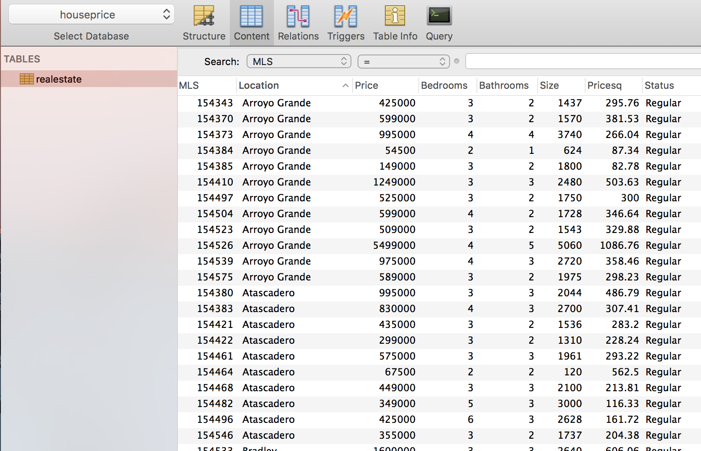
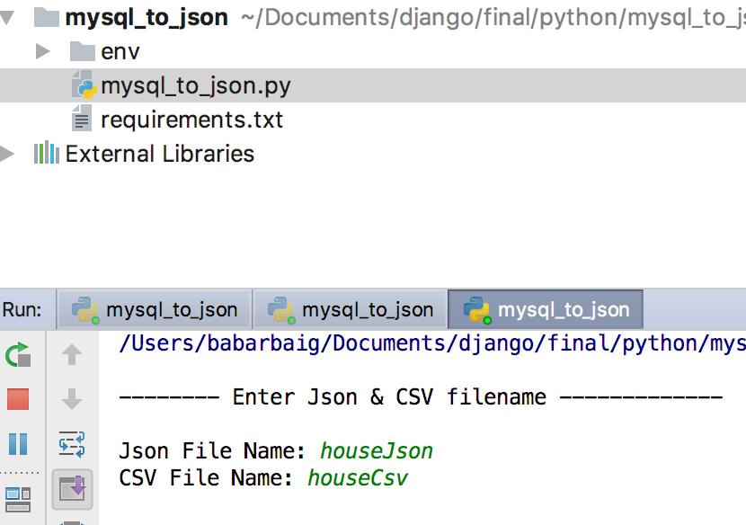
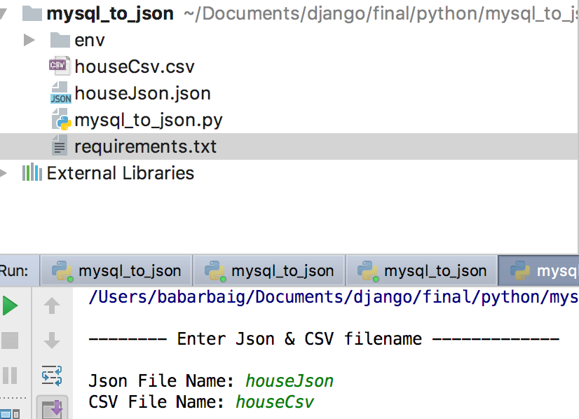
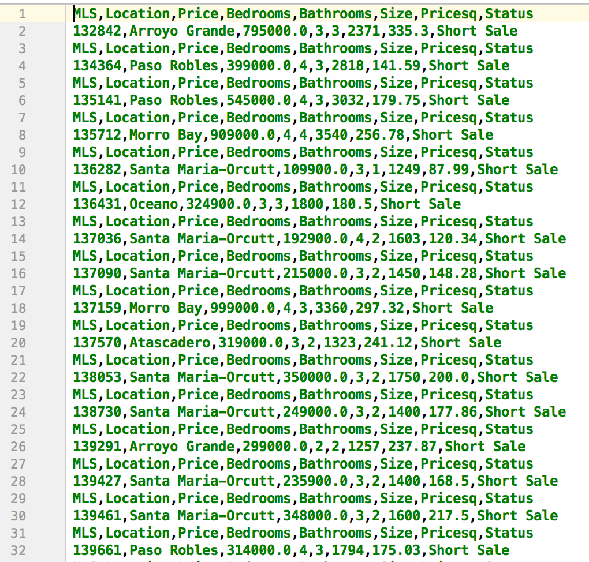
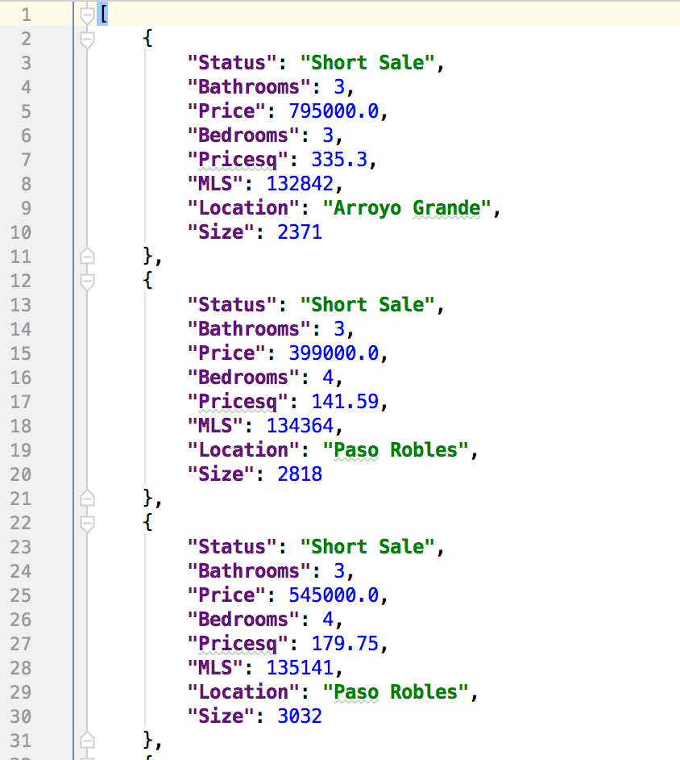
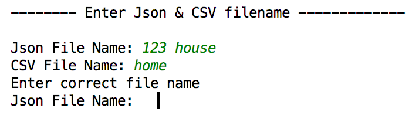

# mysql_to_json_csv
This script converts MySQL database tables to Json and CSV files as an output files. 

# Steps to run this script:
### Step 1.
Create a folder.

$ mkdir mysql_to_json_csv

Inside folder, create file mysql_to_json.py

Create a virtual enviroment.

$pip install virtualenv

$ cd mysql_to_json_csv

$ virtualenv env

$ source env/bin/activate

### Step 2.
Install requirements.txt

$pip install -r requirements.txt

### Step 3.
In order to establish the connection with database, edit the following function with your own database credentials.

'''----------- Function to establish a connection with database -----------'''

def dbconnect():
    
    try:
       
       db = MySQLdb.connect(
           
           host="127.0.0.1",
           
           user="username", (database username)
           
           passwd="password", (database password)
        )
    except Exception as e:
        sys.exit("Can't connect to Database")
    return db
   
 
### Step 4.
Open mysql_to_json file in PyCharm and run.

# ---- Demo ----
### Database
This how our database "houseprice" and table "realestate" looks like.

### First user input screen.
This screen will ask user to type filenames for Json and CSV output files.

### Output files.
Running this will create output files.

### Output CSV file.

### Output Json file.

### User input error handling.
Basic error handling applied. Users are only allowed to input string filename, not numbers. Warning keep prompting till get a correct filename.

